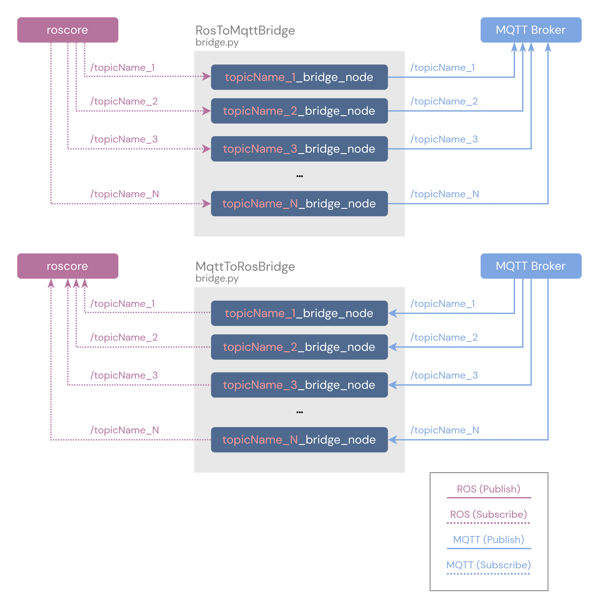

# ROS-MQTT bridge

The ROS-MQTT bridge provides a feature that allows for exchanging message between ROS protocol and MQTT protocol. The block diagram of bridge is show in below. The publisher and subscriber line in figure is based on nodes.

<div align="center">
    
</div>

---

## Getting Started

### Dependencies

- [x] ROS Neotic
- [x] Mosquitto MQTT
- [x] mosquitto-client
- [x] Python version > 3.7
    - numpy==1.20.3
    - paho_mqtt==1.6.1
    - psutil==5.8.0
    - pyfiglet==0.8.post1
    - ray==2.4.0
    - rospy==1.16.0
    - sensor_msgs==1.13.1
    - termcolor==2.3.0

### Installation

1. Clone the whole file from [GitLab](https://gitlab.com/BRAIN_Lab/biorobotics-private/exobic) to your local computer.

```sh
cd ~/<your_catkin_ws>/src
git clone xxx
```

2. Install the needed library from the requirements.txt file.

```sh
cd RosMqttBridge
```
```sh
pip install -r requirements.txt 
#or
pip3 install -r requirements.txt
```

---

## Demo

<!-- > Note: launch the `test_script.py` before launch the `bridge.py`, due to ROS-MQTT bridge can get the topic and message type from ros automatically. -->

### Prelaunch

> If an error appears in the MQTT broker's terminal like `address already in use error in mosquitto`, it means that your broker is still running **(this error usually appears when you use the broker for the first time after powering on or restarting your computer)**. To solve the error, please open a new terminal and enter the following command.

```sh
sudo systemctl stop mosquitto
```

After entering this command, you can move on to the next step and run the demo.

### Step-by-Step

1.  Build `ros_mqtt_bridge` package in your catkin workspace.

    ```sh
    cd ~/<your_catkin_ws>
    cankin_make
    ```

2. Source your `setup.bash` in ROS path and catkin workspace path.

    ```sh
    source /<ROS_path>/noetic/setup.bash
    source ~/<your_catkin_ws>/devel/setup.bash
    ```

3. Run `demo.py` to start the demo.

    ```sh
    roscd ros_mqtt_bridge
    rosrun ros_mqtt_bridgr demo.py
    ```

    After running the `demo.py`, the roscore's terminal (or not), MQTT broker's terminal (or not), a ROS publisher's terminal, a MQTT publisher's terminal, a ROS subsciber's terminal and a MQTT subscriber's terminal are launched.   

    Each terminal means ...

    | Window | Description |
    | ------ | ----------- |
    | roscore           | ROS server |
    | MQTT broker       | MQTT broker (mosquitto) for handling the whole message. |
    | ROS publisher     | Publish message via ROS using `rosbag_test.bag`. |
    | MQTT publisher    | Publish message via MQTT using `mqtt_pub.py`. |
    | ROS subscriber    | Subscribe topic from MQTT publisher <`command: rostopic echo /topic_name`>. |
    | MQTT subscribe    | Subscribe topic from ROS publisher <`command: mosquitto_sub -h host_IP -t topic_name`>. |

    > Note: This demo runs the ROS publisher before starting the bridge, which bridge automatically gets topics and message types. 

4. To stop the whole process, follow the stop process in the main terminal (the terminal where `demo.py` is running).
    - Press **q** to stop the ROS-MQTT bridge process.
    - Press **Ctrl+C** to stop and exit the process in the other terminal. In addition, some terminals will automatically close by themselves when the process ends.